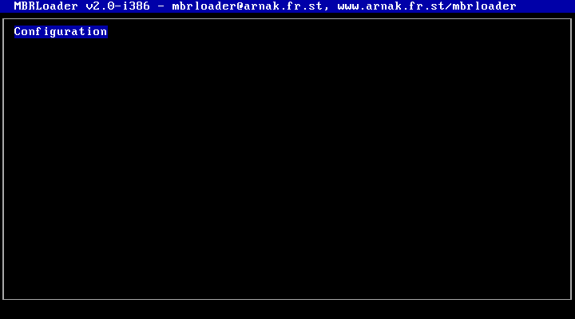
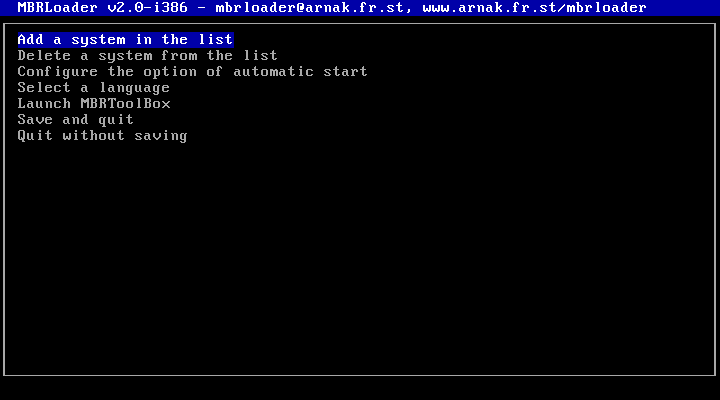
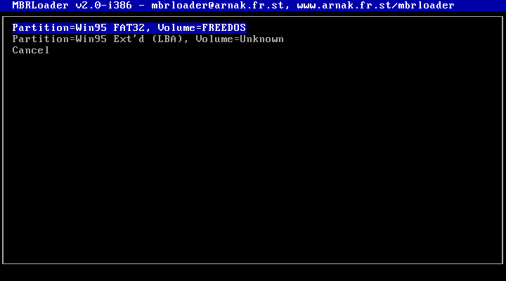
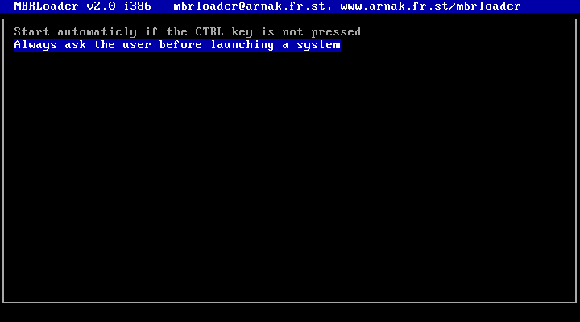
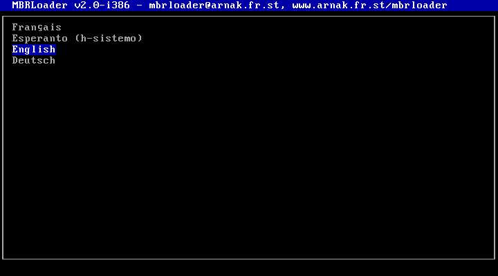
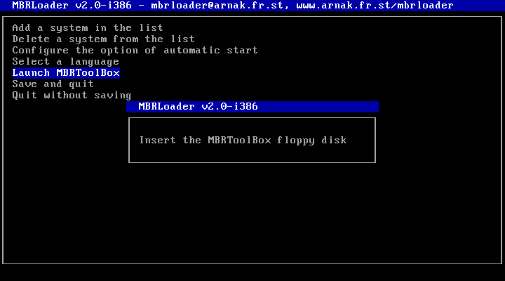
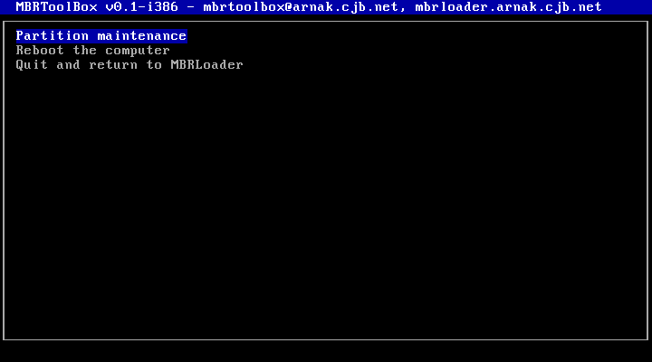
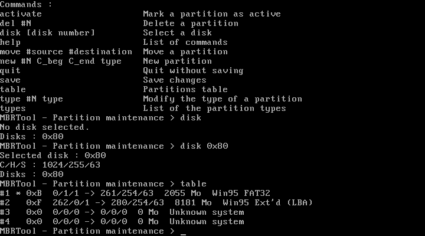
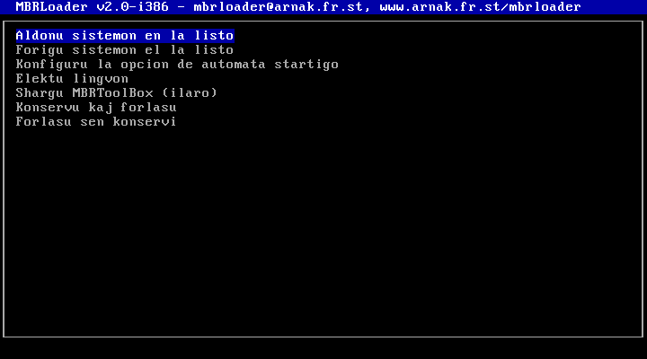

# Vintage x86 Multiboot Boot manager & Partition Tool

MBRLoader is a custom MBR boot manager/chainloader featuring a built-in multilingual interface and a text-mode partition manager
provided as an external component that can be loaded from a floppy disk (`MBRToolBox`).

I wrote this program in 2001 when I was 16 years old and used my own assembler to build it ([QuickASM](https://github.com/polletfa/QuickASM)).
Together, QuickASM and MBRLoader were my first really serious projects and to this day probably still among the most accomplished programs I built.

## Preservation Notice

**This repository is published "as-is" for historical and nostalgic purposes.** 
I have deliberately chosen **not** to refactor, modernize, or clean up the code. It is exactly as it was written over 20 years ago by a 16-year-old without academic training.

The comments, some of the function/variable names, and the documentation are in French, because back then I had not started coding in English yet.

## Features

- **Multi-Language Boot Menu**: The loader boots into a visual interactive menu supporting four languages. The default language is french.
- Runtime configuration: Configuration is done in runtime by selecting which partitions should be added to the boot menu.
- Automatic start: MBRLoader can either display a menu, or boot automatically unless CTRL is pressed on start. In that case, you can specify which menu option is the default.
   This feature was implemented so that my parents wouldn't complain about that weird menu popping up on boot all of the sudden!
- Pluggable toolbox: MBRToolBox is a separate component that can be loaded from a floppy disk. It was intended to become a collection of rescue and maintenance tools.
   The first (and only) version contains a simple partition manager.

*Notes on translations:*
- This was written before modern online translation tools existed. I did them all myself using basic school knowledge and dictionaries, so
  they're far from perfect! For example I used "registrieren" instead of "speichern" in German, because I thought it was the translation of the french "enregistrer".
- For Esperanto, I used the h-notation because I didn't know how to print diacritical marks used in Esperanto!

| | | |
| :---: | :---: | :---: |
|  |  |  |
|  |  |  |
|  |  |  |

## Original Architectural Design

**MBRLoader** and **MBRToolBox** were originally designed as a dual-component system:

1. **The Hard Drive MBR (MBRLoader):** MBRLoader was intended to be installed on the Master Boot Record of the hard drive. As it was usual for bootloaders too big to fit on the MBR,
   it has a 2 stages structure: stage 1 on the MBR, responsible for loading and launching stage 2, and stage 2 on the following sectors.
2. **The Rescue Floppy (MBRToolBox):** The toolbox was designed to evolve into a collection of tools that could grow too large to fit before the first partition, so it was
   intended to be stored on a floppy disk and loaded on request.

It was however also possible to install both components on a single floppy disk (mostly intended for testing during development), which is why MBRToolBox was installed on sector 18
and not directly at the start of the floppy disk.

## Build on a Modern System

You can use the provided [floppy disk image](bin/MBRLoader%2BToolBox.flp), or build your own.

To build MBRLoader and MBRToolBox, you need [QuickASM](https://github.com/polletfa/QuickASM), so please first clone QuickASM's repository and compile it.

You can then assemble MBRLoader and MBRToolBox:

```bash
PATH=$PATH:../QuickASM/bin/linux/ make step1 step2
PATH=$PATH:../../QuickASM/bin/linux/ make -C ToolBox toolbox
```

An installer written in C is also provided, but it was designed to install on a real disk, so unless you still use floppy disks or want to install MBRLoader on your computer
(I do NOT recommend this), the installer is not useful. Instead we can use dd to create a floppy disk image:

```bash
# Create an empty 1.44 MB floppy disk image
dd if=/dev/zero of=floppy.flp bs=1024 count=1440

# Install Stage 1 on sector 0
dd if=step1 of=floppy.flp bs=512 conv=notrunc

# Install Stage 2 on sectors 1-17
dd if=step2 of=floppy.flp bs=512 seek=1 conv=notrunc

# Install ToolBox on sectors 18 and onwards
dd if=ToolBox/toolbox of=floppy.flp bs=512 seek=18 conv=notrunc
```

## Test

You can test the floppy disk image with any Virtual Machine like VirtualBox or Bochs. Here is how to do it with QEMU:

```bash
# Create a fake hard drive image (empty)
dd if=/dev/zero of=fake_hdd.img bs=1M count=10

# Launch
qemu-system-x86_64 \
   -drive file=floppy.flp,format=raw,index=0,if=floppy \
   -drive file=fake_hdd.img,format=raw,index=0 \
   -no-fd-bootchk \
   -boot a
```

Note: The -no-fd-bootchk flag is necessary because the floppy disk image doesn't have the boot flag, which was tolerated by most BIOS at the time.

MBRLoader however cannot deal with empty partition tables (this is an edge case that I didn't get to test on the family computer),
so we need to create a partition table before we try to configure a boot menu, otherwise MBRLoader will crash:

- First change the language (Note: the pre-compiled image is already configured with English):
   - Open "Configuration"
   - Open "Choix d'une langue"
   - Select "English"
- Open the partition manager:
   - Select "Launch MBRToolBox"
   - Click enter when asked to insert the floppy disk (it's already inserted)
   - Select "Partition maintenance"
- Create a partition table:
   ```
   disk 0x80
   new #1 1 18 0x83
   save
   quit
   ```

You can now safely play around with MBRLoader (don't try to boot however, or it will just freeze, since the partition is empty).

If you use it with a hard drive image containing a real system, be aware that it may fail to boot some systems: it only loads the first
sector of a partition and launches it, so it requires the partition to have it's own boot loader. This was the case with Windows 98 or XP,
but not necessarily with Linux, unless LILO had been installed on the partition rather than the MBR.

## A Note on Implementation

QuickASM supported 16 bit registers and operations only. For the original version of MBRLoader, this was enough. However to write the partition manager from MBRToolBox, I needed
to use some 32 bit operations. I was focusing on MBRLoader/MBRToolBox and didn't want to spend time extending QuickASM instruction set, so I used a workaround to bypass this limitation:

```assembly
.octet 0x66       ; 32-bit override prefix
mov bx, 0         ; Assembled as 16-bit, executes as: mov ebx, 0
.mot 0            ; Upper 16 bits padding
```

## Abandoned version 3.0

At some point I started to rewrite a new version, which was designed almost like a mini operating system,
with it's own file system and standard library. I never finished it (probably stopped when I went to the university),
but you can still see the code and the design in the [develop branch](https://github.com/polletfa/MBRLoader/tree/develop).
